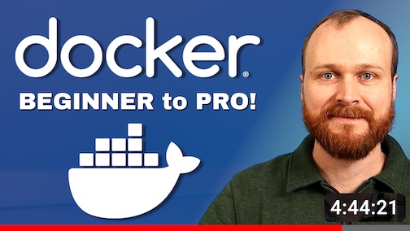

# DevOps Directive Docker Course

This is the companion repo to: [Complete Docker Course - From BEGINNER to PRO! (Learn Containers)](https://youtu.be/RqTEHSBrYFw)

Thank you to [Shipyard](https://shipyard.build/) for sponsoring this course! It is because of their support that I am able to provide it to the community free of charge!

Shipyard is the easiest way to generate on demand ephemeral environments (aka a new environment for every pull request). Sign up today at https://shipyard.social/DevOpsDirectivePromo! The first 300 people to use the promo code "DEVOPSDIRECTIVE" will receive an additional 30 days free on either their startup or business tier plans!

## [01 - History and Motivation](01-history-and-motivation/README.md)

Examines the evolution of virtualization technologies from bare metal, virtual machines, and containers and the tradeoffs between them.

## [02 - Technology Overview](02-technology-overview/README.md)

Explores the three core Linux features that enable containers to function (cgroups, namespaces, and union filesystems), as well as the architecture of the Docker components.

## [03 - Installation and Set Up](03-installation-and-set-up/README.md)

Covers the steps to install and configure Docker Desktop on your system.

## [04 - Using 3rd Party Containers](04-using-3rd-party-containers/README.md)

Before we build our own container images, we can familiarize ourselves with the technology by using publicly available container images. This section covers the nuances of data persistence with containers and then highlights some key use cases for using public container images.

## [05 - Example Web Application](05-example-web-application/README.md)

Learning about containerization is interesting, but without a practical example it isn't very useful. In this section we create a 3 tier web application with a React front end client, two apis (node.js + golang), and a database. The application is as simple as possible while still providing a realistic microservice system to containerize.

## [06 - Building Container Images](06-building-container-images/README.md)

Demonstrates how to write Dockerfiles and build container images for the components of the example web app. Starting with a naive implementation, we then iterate towards a production ready container image.

## [07 - Container Registries](07-container-registries/README.md)

Explains what container registries are and how to use them to share and distribute container images.

## [08 - Running Containers](08-running-containers/README.md)

Using the containerized web application from sections 05 and 06, we craft the necessary commands to run our application with Docker and Docker Compose. We also cover the variety of runtime configuration options and when to use them.

## [09 - Container Security](09-container-security/README.md)

Highlights best practices for container image and container runtime security.

## [10 - Interacting with Docker Objects](10-interacting-with-docker-objects/README.md)

Describes how to use Docker to interact with containers, container images, volumes, and networks.

## [11 - Development Workflows](11-development-workflow/README.md)

Establishes tooling and configuration to enable improved developer experience when working with containers.

## [12 - Deploying Containers](12-deploying-containers/README.md)

Demonstrates deploying container applications to production using three different approaches: railway.app, a single node Docker Swarm, and a Kubernetes cluster.
